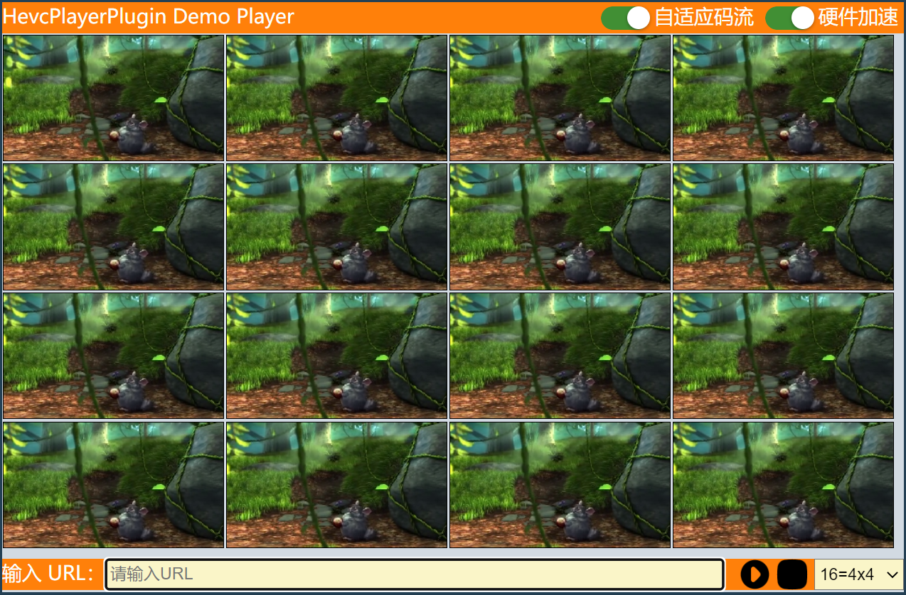

[](https://github.com/HevcPlayerPlugin/HevcPlayerPlugin/releases/latest)

[](https://en.cppreference.com/)
[](https://github.com/HevcPlayerPlugin/HevcPlayerPlugin)
[](https://github.com/HevcPlayerPlugin/HevcPlayerPlugin/pulls)
[](https://github.com/HevcPlayerPlugin/HevcPlayerPlugin)
[](https://jq.qq.com/?_wv=1027&k=N2VUK58S)
## 声明
本项目采用宽松的MIT软件许可协议。

## 感谢
本项目灵感来自于开源社区，主要参考了以下几个开源项目（包括但不限于）：

**FFmpeg**

主要使用FFmpeg来做解封装(demux)和解码(decode)。代码来自于[ffplay.c](https://ffmpeg.org/doxygen/trunk/ffplay_8c_source.html)、[`demuxing_decoding.c`](https://ffmpeg.org/doxygen/trunk/demuxing_decoding_8c-example.html)和 [`hw_decode.c`](https://ffmpeg.org/doxygen/trunk/hw_decode_8c-example.html)

**Websocket**

采用开源项目[websocketpp-0.8.2](https://github.com/zaphoyd/websocketpp)作为服务器，跟前端保持一个长连接，信令和数据共用一个socket句柄，信令采用`JSON`格式，媒体数据采用`二进制`格式。代码来自于：[websocketpp/examples](https://github.com/zaphoyd/websocketpp/tree/master/examples)

**WebGL**

~~H5使用Canvas来绘图，采用YUV420格式。为了提升渲染性能，限定了视频分辨率，要求图像宽度必须为8的倍数（使用FFmpeg的libswscale模块进行转换）。代码来自于：[IVWEB 玩转 WASM 系列-WEBGL YUV渲染图像实践](https://juejin.cn/post/6844904008054751246)~~
H5使用Canvas来绘图，默认采用NV12格式。YUV数据首先被构建为`VideoFrame`，再通过`drawImage`进行绘图。代码比之前的方式要简洁很多。

~~**Web Audio**~~

~~FFmpeg解码出来的音频数据是PCM格式，使用H5的Web Audio Api来播放，代码来自于： [pcm-player](https://github.com/samirkumardas/pcm-player)~~
Web Audio兼容性不好，某些PCMA音频会出现噪音，修改为SDL2播放。

**前端示例**

见htdocs/player，代码来自于[YUV-Webgl-Video-Player](https://github.com/p4prasoon/YUV-Webgl-Video-Player)，分屏代码来自于[JavaScript之类操作：HTML5 canvas多分屏示例](https://blog.csdn.net/boonya/article/details/82784952)

开源社区的发展离不开大家的无私奉献，再次感谢上面的作者以及其他不知名的各位。

## 编译
```
cmake . -A "Win32" -B build
```

## 打包
打包脚本可以参考`scripts\package`

## 性能

**系统配置**
- CPU： Intel(R) Core(TM) i5-9500 CPU @ 3.00GHz
- GPU： Intel(R) UHD Graphics 630

**6** 路 4K@H.265 视频，结果如下：

| 程序 | CPU | 内存 | GPU |
| --- | --- | --- | --- |
| HevcPlayerPlugin | <10% | <800M | <85% |
| Chrome | <10% | <200M | 15% |

**16** 路 2K@H.265 视频，结果如下：

| 程序 | CPU | 内存 | GPU |
| --- | --- | --- | --- |
| HevcPlayerPlugin | <15% | <1600M | <90% |
| Chrome | <15% | <150M | 5% |
	
**16** 路 1080P@H.265 视频，结果如下：

| 程序 | CPU | 内存 | GPU |
| --- | --- | --- | --- |
| HevcPlayerPlugin | <10% | <800M | <60% |
| Chrome | <5% | <200M | 5% |

> 备注： Chrome一个标签页最多只能创建16个WebGL Context，所以1080P测试的GPU使用率并没有达到100%，理论上应该能达到25路。
## 示例
[下载](https://github.com/duiniuluantanqin/HevcPlayerPlugin/releases/)已经编译好的Windows二进制文件，安装后打开测试页面，路径在程序安装目录下`player/index.html`。
<br>


## 联系我们
QQ群：193047264

